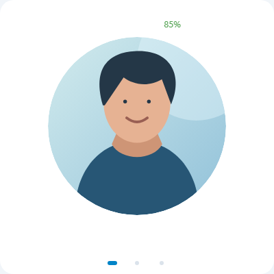
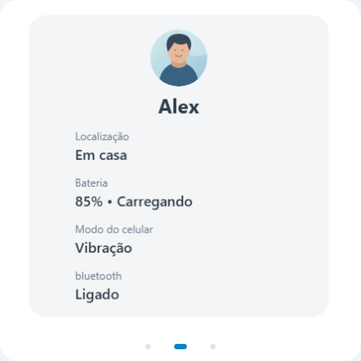
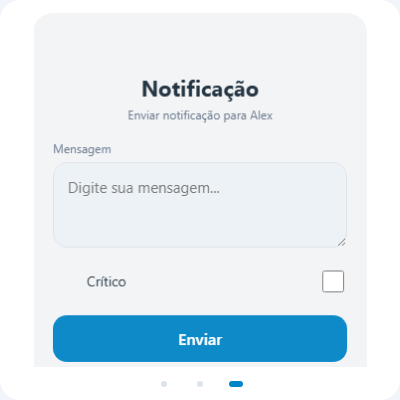
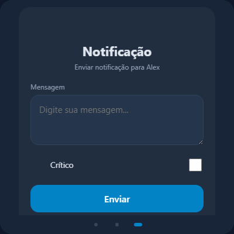

# Person LabsWill HA

[](https://github.com/Willyanlz/person-labswill-ha/releases)
[](https://www.hacs.xyz/docs/faq/custom_repositories/)
[](https://github.com/Willyanlz/person-labswill-ha/actions/workflows/release.yml)
[](https://github.com/Willyanlz/person-labswill-ha/actions/workflows/hacs.yml)
[](LICENSE)

**Uma pessoa, as informações do celular e notificações no mesmo card.**

Card Lovelace independente para entidades `person` do Home Assistant. Mostra perfil e localização, reúne sensores opcionais do celular e pode enviar notificações normais ou Critical para um serviço `notify` escolhido por você. Inclui três páginas navegáveis, editor visual e suporte a temas claro e escuro.



[](https://my.home-assistant.io/redirect/hacs_repository/?owner=Willyanlz&repository=person-labswill-ha&category=plugin)

· [Versões](https://github.com/Willyanlz/person-labswill-ha/releases) · [Changelog](CHANGELOG.md) · [Reportar problema](https://github.com/Willyanlz/person-labswill-ha/issues)

## Recursos

- Páginas Perfil, Informações e Notificação, habilitáveis e reordenáveis.
- Swipe por toque, arraste com mouse, teclado e indicadores opcionais; não depende de outros custom cards.
- Nome e foto obtidos da entidade `person`, com fallback quando a foto ou a entidade não está disponível.
- Barra de status e detalhes com localização e sensores opcionais de bateria, estado da bateria, ringer e Bluetooth.
- Envio explícito a um serviço `notify`, com estado do formulário local e payload Critical compatível com iOS.
- Editor visual com seletor de entidade `person`, preview do nome, validação e controles dependentes da configuração.
- Sugestão do card no seletor de entidades para pessoas em Home Assistant 2026.6 ou superior.

As páginas Informações e Perfil ficam habilitadas por padrão. Notificação começa desabilitada porque precisa de um serviço `notify` configurado.

## Instalação pelo HACS

Requer Home Assistant 2026.6 ou superior, HACS e um navegador atualizado. Este projeto é um **card de dashboard Lovelace**, não é uma integração, add-on ou sensor.

1. Abra no Home Assistant [Adicionar repositório Person LabsWill HA](https://my.home-assistant.io/redirect/hacs_repository/?owner=Willyanlz&repository=person-labswill-ha&category=plugin), ou abra **HACS → ⋮ → Repositórios personalizados**.
2. Se adicionar manualmente, informe `https://github.com/Willyanlz/person-labswill-ha` e escolha a categoria **Dashboard** (em versões antigas, **Lovelace / Plugin**).
3. Encontre **Person LabsWill HA**, instale a versão desejada e recarregue o painel.
4. Confira em **Configurações → Painéis → Recursos** se existe `/hacsfiles/person-labswill-ha/person-central-card.js` como **Módulo JavaScript**. O HACS pode registrar o recurso automaticamente; não crie uma segunda entrada.
5. Adicione o card pelo seletor de cards e escolha uma entidade `person`, ou use o YAML mínimo abaixo.

Se o card não aparecer após atualizar, faça uma recarga completa do navegador ou do aplicativo do painel.

### Instalação como repositório personalizado

Caso o repositório ainda não esteja disponível na busca padrão do HACS, adicione a URL `https://github.com/Willyanlz/person-labswill-ha` como repositório personalizado, na categoria **Dashboard**. Depois, instale e atualize pelo HACS como descrito acima. O repositório publica releases com o bundle `person-central-card.js`.

### Instalação manual

1. Baixe `person-central-card.js` em [Releases](https://github.com/Willyanlz/person-labswill-ha/releases) ou copie `dist/person-central-card.js` deste repositório.
2. Coloque o arquivo em `/config/www/person-central-card.js`.
3. Em **Configurações → Painéis → Recursos**, adicione `/local/person-central-card.js` com o tipo **Módulo JavaScript**.
4. Recarregue o painel e adicione o card usando `type: custom:person-central-card`.

## Primeiro card

```yaml
type: custom:person-central-card
person: person.julia
```

Troque `person.julia` por uma entidade existente em **Ferramentas de desenvolvedor → Estados**. O nome e a foto são lidos de `person.attributes.friendly_name` e `person.attributes.entity_picture`; não é preciso repetir esses valores na configuração.

Ao adicionar pelo seletor, o card escolhe a primeira entidade `person` disponível como sugestão inicial. Também é possível selecionar a pessoa diretamente no editor visual. Sensores não são obrigatórios.

## Exemplo completo

```yaml
type: custom:person-central-card
person: person.julia
language: pt

pages:
  profile:
    enabled: true
  details:
    enabled: true
  notification:
    enabled: true
page_order:
  - profile
  - details
  - notification

profile:
  image:
    mode: circle
    size: 65
    object_fit: cover
    background_position: center
  status:
    enabled: true
    show_location: true
    show_ringer: true
    show_battery: true
    show_bluetooth: true
    position: top
    background: auto
    border_radius: 18
    opacity: 0.85

details:
  show_image: true
  show_name: true
  show_location: true
  show_battery: true
  show_battery_state: true
  show_ringer: true
  show_bluetooth: true

sensors:
  battery: sensor.iphone_julia_battery_level
  battery_state: sensor.iphone_julia_battery_state
  ringer: sensor.iphone_julia_ringer_mode
  bluetooth: binary_sensor.iphone_julia_bluetooth_state

notification:
  notify_service: notify.mobile_app_iphone_julia
  title: Central
  critical:
    enabled: true
    default: false
    volume: 1

appearance:
  border_radius: 20
  aspect_ratio: 1
  padding: 0
  background: auto

swipe:
  enabled: true
  show_indicators: true
  loop: false
  effect: slide

colors:
  home: '#50A14F'
  away: '#e45649'
  zone: '#52adff'
  unknown: 'var(--secondary-text-color)'
  bluetooth_on: '#52adff'
  bluetooth_off: '#e45649'
  battery_high: '#50A14F'
  battery_medium: '#FFA500'
  battery_low: '#e45649'
  ringer_normal: '#50A14F'
  ringer_vibrate: '#FFA500'
  ringer_silent: '#e45649'
```

O serviço em `notify_service` precisa existir em **Ferramentas de desenvolvedor → Ações**. O card não tenta deduzir um serviço pelo nome da pessoa. Para testar primeiro sem configurar sensores ou notificações, comece pelo exemplo mínimo e acrescente as opções necessárias.

## Páginas e interação

| Página | Conteúdo |
| --- | --- |
| `profile` | Foto circular, imagem de fundo ou sem foto; status configuráveis em uma barra. A foto abre mais informações da pessoa. |
| `details` | Foto, nome, localização e linhas de sensores disponíveis. Bateria e estado de carga são agrupados quando ambos estão habilitados. |
| `notification` | Mensagem, toggle Critical opcional, envio e feedback. A página só pode ser habilitada quando `notify_service` é válido. |

O card permite arrastar horizontalmente com mouse ou dedo; os dots e as setas do teclado também navegam entre páginas. A transição combina slide horizontal com um leve ajuste de opacidade e escala, sem rotação 3D. Com uma única página ativa não há navegação ou indicadores desnecessários. A configuração `swipe.enabled: false` desativa o gesto horizontal, mas mantém a navegação por teclado. `swipe.loop: true` permite circular entre a primeira e a última página.

Gestos iniciados em textarea, toggle, botão ou outros controles não navegam pelas páginas. Isso preserva digitação, seleção e operação por toque. O formulário mantém mensagem e Critical ao navegar ou atualizar estados; após envio bem-sucedido, limpa os campos. Trocar a pessoa ou o serviço redefine o rascunho para evitar enviar para o destinatário errado.

## Editor visual

O editor está dividido em **Pessoa**, **Páginas**, **Perfil**, **Status**, **Sensores**, **Informações**, **Notificação** e **Aparência**. Ele usa o seletor de entidades do Home Assistant quando disponível e mantém controles HTML como alternativa. Alterações emitem `config-changed` e preservam opções avançadas que não são expostas na interface.

- **Pessoa:** seleciona apenas entidades do domínio `person` e mostra o nome como preview.
- **Páginas:** habilita ou desabilita cada página e altera a ordem com os botões de subir/descer. Também controla swipe, indicadores e loop.
- **Perfil:** escolhe o modo da foto; tamanho e ajuste aparecem para imagem circular, posição aparece para background.
- **Status:** habilita a barra e, quando ativa, permite configurar cada indicador, posição e fundo.
- **Sensores:** escolhe as entidades opcionais de bateria, estado da bateria, ringer e Bluetooth.
- **Informações:** seleciona quais dados exibir na segunda página.
- **Notificação:** escolhe ou informa o serviço, título e parâmetros Critical. O editor indica quando falta configurar o serviço.
- **Aparência:** ajusta raio, altura, proporção, fundo e espaçamento.

## Opções

As opções são compatíveis com YAML mesmo quando o card foi criado pelo editor visual. Os valores abaixo são os padrões, salvo indicação em contrário.

| Opção | Padrão | Descrição |
| --- | --- | --- |
| `person` | obrigatório | Entity ID do domínio `person`. |
| `language` | `pt` | `pt`, `en` ou `auto` para usar o idioma do Home Assistant. |
| `pages.profile.enabled` | `true` | Exibe a página Perfil. Também aceita o formato legado `profile.enabled`. |
| `pages.details.enabled` | `true` | Exibe a página Informações. Também aceita `details.enabled`. |
| `pages.notification.enabled` | `false` | Exibe Notificação; exige `notification.notify_service`. Também aceita `notification.enabled`. |
| `page_order` | páginas habilitadas | Ordem das páginas habilitadas. Cada página deve aparecer uma única vez. |
| `profile.image.mode` | `circle` | `circle`, `background` ou `none`. Se não houver foto válida, mostra ícone de pessoa. |
| `profile.image.size` | `65` | Diâmetro da imagem circular em porcentagem; aceita 10–100. |
| `profile.image.object_fit` | `cover` | `cover` ou `contain` para imagem circular. |
| `profile.image.background_position` | `center` | Posição CSS da foto; usada no modo background e como posição do avatar. |
| `profile.status.enabled` | `true` | Mostra a barra de status quando existem itens para exibir. |
| `profile.status.show_location` | `true` | Inclui a localização da entidade `person`. |
| `profile.status.show_ringer` | `false` | Inclui o sensor `sensors.ringer`, se configurado. |
| `profile.status.show_battery` | `false` | Inclui o sensor `sensors.battery`, se configurado. |
| `profile.status.show_bluetooth` | `false` | Inclui o sensor `sensors.bluetooth`, se configurado. |
| `profile.status.position` | `top` | `top` ou `bottom`. |
| `profile.status.background` | `auto` | `auto` segue o tema; também aceita uma cor CSS. |
| `profile.status.border_radius` | `18` | Raio da barra, em pixels. |
| `profile.status.opacity` | `0.85` | Opacidade do fundo da barra, de 0 a 1. |
| `details.show_image` / `show_name` | `true` | Exibe avatar e nome na página Informações. |
| `details.show_location` | `true` | Exibe localização. |
| `details.show_battery` / `show_battery_state` | `true` | Exibe bateria e estado de carga se os respectivos sensores estiverem configurados. |
| `details.show_ringer` / `show_bluetooth` | `true` | Exibe esses sensores quando configurados. |
| `sensors.battery` | vazio | Entity ID do nível de bateria, esperado entre 0 e 100. |
| `sensors.battery_state` | vazio | Entity ID do estado de carga. |
| `sensors.ringer` | vazio | Entity ID do modo do celular (`normal`, `vibrate`, `silent`). |
| `sensors.bluetooth` | vazio | Entity ID do Bluetooth (`on`/`off`). |
| `notification.notify_service` | vazio | Serviço explícito `notify.nome_do_servico`; obrigatório com a página ativa. |
| `notification.title` | `Central` | Título enviado na notificação. |
| `notification.critical.enabled` | `true` | Permite exibir a opção Critical no formulário. |
| `notification.critical.default` | `false` | Estado inicial do toggle Critical. |
| `notification.critical.volume` | `1` | Volume Critical entre 0 e 1. |
| `appearance.border_radius` | `20` | Raio dos cantos do card, em pixels. |
| `appearance.aspect_ratio` | `1` | Proporção largura/altura; padrão quadrado. Faixa aceita: 0,4–3. |
| `appearance.card_height` | automático | Altura fixa opcional em pixels, de 180 a 1600. |
| `appearance.padding` | `0` | Espaçamento interno em pixels. |
| `appearance.background` | `auto` | `auto` segue o tema do HA; também aceita cor CSS válida. |
| `swipe.enabled` | `true` | Habilita swipe/arraste horizontal quando há mais de uma página. |
| `swipe.show_indicators` | `true` | Mostra os dots de navegação. |
| `swipe.loop` | `false` | Permite navegar circularmente. |
| `swipe.effect` | `slide` | Slide horizontal animado com transição sutil de opacidade e escala; valores antigos `coverflow` são convertidos para `slide`. |
| `colors.*` | cores do card | Sobrescreve as cores de localização, bateria, ringer e Bluetooth; consulte abaixo. |

Sensores não configurados são omitidos; sensores configurados que desaparecem são apresentados como indisponíveis. Um estado de pessoa que não seja `home` nem `not_home` é tratado como nome de zona personalizada.

### Cores

Todas as cores podem ser substituídas por cores CSS válidas, inclusive variáveis do tema Home Assistant:

| Chave | Uso |
| --- | --- |
| `colors.home` / `colors.away` / `colors.zone` / `colors.unknown` | Localização em casa, fora, zona personalizada e estado indisponível. |
| `colors.bluetooth_on` / `colors.bluetooth_off` | Bluetooth ligado ou desligado. |
| `colors.battery_high` / `colors.battery_medium` / `colors.battery_low` | Bateria acima de 50%, entre 31–50% e até 30%. |
| `colors.ringer_normal` / `colors.ringer_vibrate` / `colors.ringer_silent` | Modos normal, vibração e silencioso. |

## Notificações

O card chama o serviço `notify` selecionado, enviando `title` e a mensagem digitada. Mensagens vazias são recusadas, envios simultâneos são bloqueados e o estado de erro permite tentar novamente. Se o serviço não existir ou ficar indisponível, o card informa o problema sem interromper as demais páginas.

Com Critical ativado, o payload inclui `data.push.sound` com `name: default`, `critical: 1` e o volume escolhido. Esse modo é destinado a dispositivos compatíveis, como iOS; o comportamento final depende do serviço e das configurações do aparelho.

## Tema e acessibilidade

O card usa variáveis CSS do Home Assistant para cores de texto, fundo, divisores e cor primária, sem presumir texto branco. Imagens inválidas ou com protocolo não permitido não são carregadas. O conteúdo de pessoa e mensagem é renderizado como texto, não como HTML.

## Atualização

Atualize pelo HACS e recarregue completamente o painel. Para instalação manual, substitua o arquivo JavaScript pelo asset da nova release e recarregue o navegador.

[Mapeamento do protótipo e decisões técnicas](docs/MIGRATION.md) · [Changelog](CHANGELOG.md)

## FAQ e solução de problemas

**O card não aparece no seletor.** Confirme que o recurso JavaScript foi adicionado como módulo, use `/hacsfiles/person-labswill-ha/person-central-card.js` na instalação HACS ou `/local/person-central-card.js` na instalação manual, e faça uma recarga completa. O picker também pode receber diretamente o YAML do primeiro card.

**A entidade de pessoa não é aceita.** O campo deve ser um entity ID existente do domínio `person`, por exemplo `person.julia`; sensores, `device_tracker` e zonas não substituem uma entidade `person` nesse campo.

**A página Notificação não habilita ou não envia.** Informe um serviço existente como `notify.mobile_app_iphone_julia`. O nome do serviço deve corresponder a uma ação disponível no Home Assistant. Confirme também que o celular está registrado para receber notificações.

**A bateria, o ringer ou o Bluetooth não aparecem.** Informe o entity ID em `sensors`, confira seu estado em Ferramentas de desenvolvedor e habilite o indicador em Status ou Informações. Sensores não são inferidos automaticamente pelo nome da pessoa.

**A foto ou o nome estão ausentes.** Confira `friendly_name` e `entity_picture` nos atributos da entidade `person`. Sem foto, o card usa o fallback visual; se a entidade estiver indisponível, mostra um estado discreto.

**As alterações não aparecem depois de atualizar.** Recarregue o recurso JavaScript com cache limpo e confirme que não existem recursos duplicados apontando para cópias antigas do card.

**O swipe não funciona.** Verifique se há pelo menos duas páginas ativas e `swipe.enabled: true`. Os dots, setas e teclado continuam disponíveis mesmo quando o swipe está desabilitado.

## Prévia das páginas

| Perfil | Informações | Notificação |
| --- | --- | --- |
|  |  |  |

Tema escuro: 

## Créditos e limites de validação

O card é distribuído sob a [licença MIT](LICENSE) e inclui Lit no bundle. Os testes Playwright exercitam o editor e o card com estados e serviços Home Assistant simulados. Uma instalação real pelo HACS, o serviço de notificação e o recebimento no dispositivo precisam ser validados no Home Assistant do usuário.
